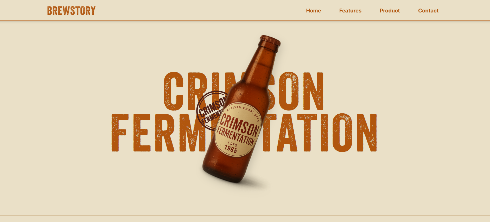

### Brewstory - Brewery Landing Page

A modern, animated brewery landing page built with **React**, **TailwindCSS**, and **GSAP**.  
The site blends vintage design with interactive motion effects to create an engaging storytelling experience.

## Features
- **Hero Animations** - Smooth GSAP-powered transitions for text and images.
- **Scroll-triggered Timeline** - Vintage brewery story unfolds with interactive scroll effects.
- **Ingredient Highlights** - Animated ingredient showcase with styled grid layout.
- **Responsive Design** - Optimized for desktop, tablet, and mobile.
- **Modern + Vintage Aesthetic** - A perfect balance of bold typography and minimal design.

## Setup Instructions

### 1. Clone repo

<pre>
git clone https://github.com/ruturkoladiya/brewstory-landing-gsap.git
</pre>

### 2. Install dependencies

`npm install`

### 3. Start React App

`npm run dev`
  
  

## Tech Stack
- **React** - UI framework
- **TailwindCSS** - Styling
- **GSAP + ScrollTrigger** - Animations

This project was inspired by the Pixel Perfect YouTube channel.
Special thanks to them for the amazing tutorials